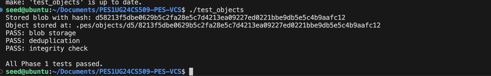
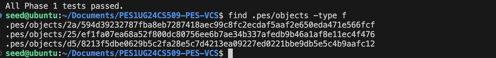
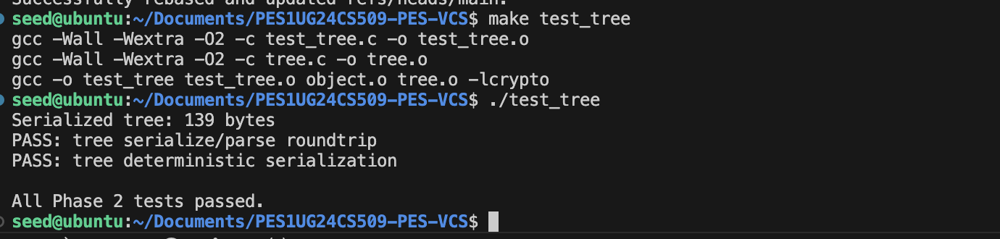
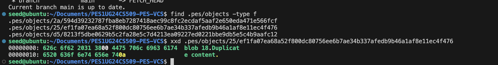
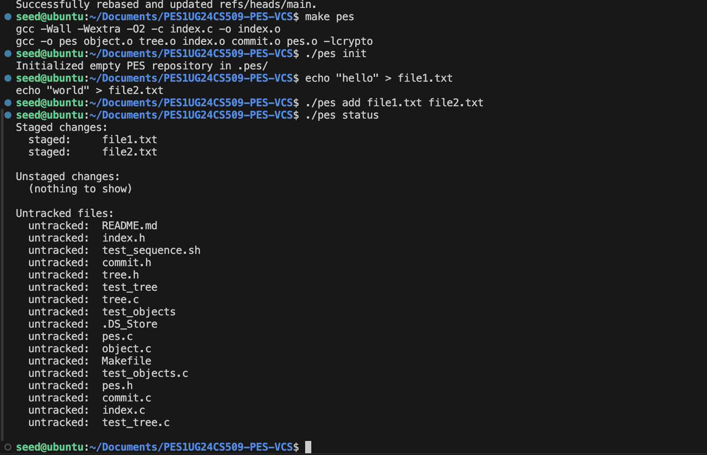
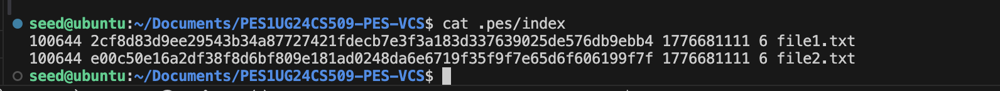
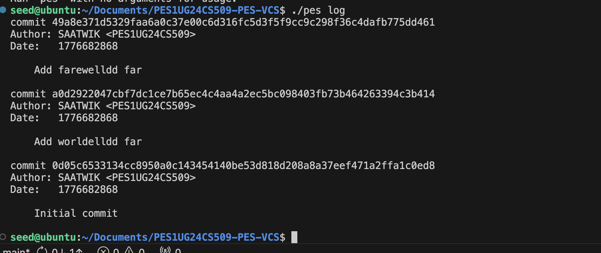
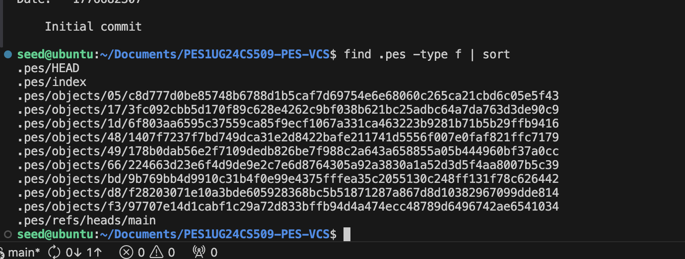
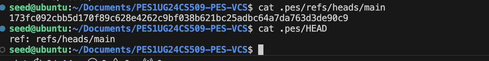
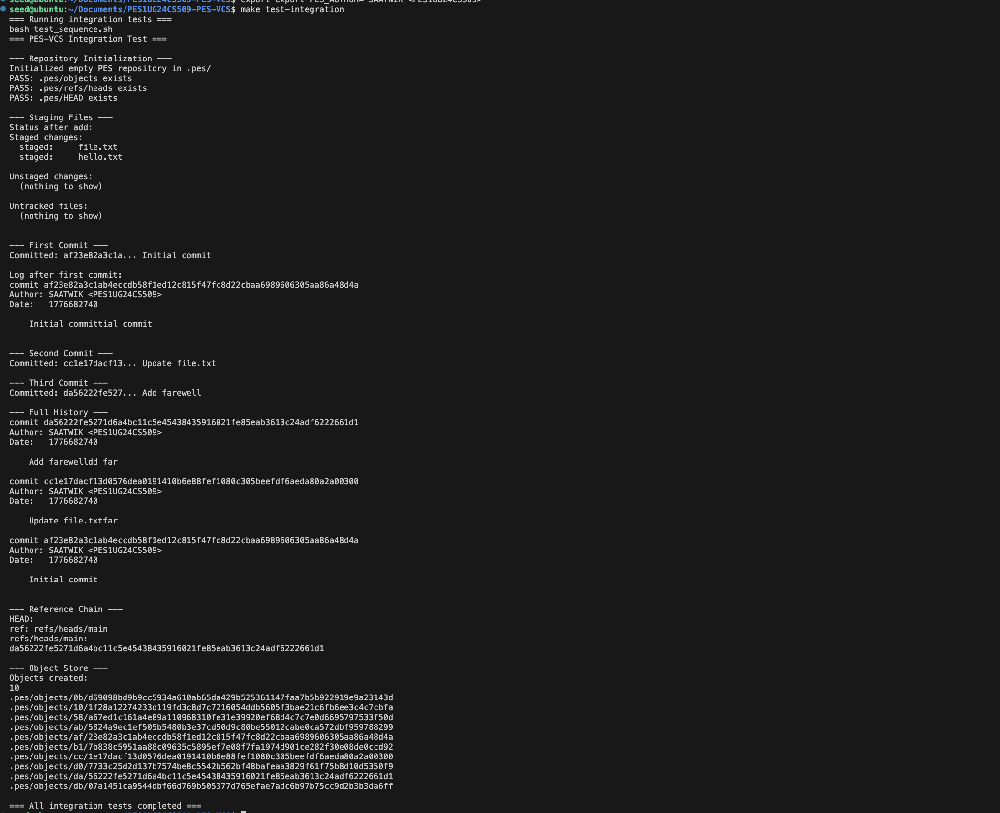

# PES-VCS Submission Checklist and Report

This README is rewritten as a submission-focused report with direct evidence links and complete answers for Phase 5 and Phase 6.

## 1. Submission Checklist

- [x] Repository contains required source files (`object.c`, `tree.c`, `index.c`, `commit.c`, headers, tests, `Makefile`)
- [x] Screenshot evidence is available for Phases 1 to 5
- [x] Phase 5 analysis questions answered
- [x] Phase 6 analysis questions answered
- [x] PDF report generated at repository root: `report.pdf`

## 2. Screenshot Evidence (Inline Preview)

### Phase 1
1A: `./test_objects` output showing tests passing.

1B: `.pes/objects` sharded storage evidence.

### Phase 2
2A: `./test_tree` output showing tests passing.

2B: Raw tree/object bytes (`xxd`) evidence.

### Phase 3
3A: `pes init` -> `pes add` -> `pes status` sequence.

3B: `.pes/index` text-format staging data.

### Phase 4
4A: `pes log` output showing commit history.

4B: `.pes` file growth / stored objects evidence.

4C: Branch reference and `HEAD` pointer evidence.

### Phase 5
5A: Integration test evidence.

## 3. Phase 5 Questions and Answers

### Q5.1
**Question:** A branch in Git is just a file in `.git/refs/heads/` containing a commit hash. Creating a branch is creating a file. Given this, how would you implement `pes checkout <branch>` - what files need to change in `.pes/`, and what must happen to the working directory? What makes this operation complex?

**Answer:**
To implement `pes checkout <branch>` in PES-VCS:

1. Resolve branch target:
   - Read `.pes/refs/heads/<branch>` to get the target commit hash.
   - If branch does not exist, fail with an error.

2. Update pointer metadata in `.pes/`:
   - Rewrite `.pes/HEAD` as `ref: refs/heads/<branch>` (for normal branch checkout).
   - Keep `.pes/refs/heads/<branch>` unchanged during checkout; only `HEAD` changes here.

3. Materialize the target commit snapshot into working directory:
   - Read target commit object, then target tree hash.
   - Recursively traverse tree objects.
   - For each blob entry, write file bytes to working directory path and set executable bit from mode.
   - For entries missing in target tree but present in current tracked state, delete those files.
   - Create/remove directories to exactly match the tree.

4. Rebuild index to match checked-out tree:
   - Replace `.pes/index` entries so index becomes a clean mirror of checked-out commit tree.

Why this is complex:
- Checkout is not only pointer switching; it is a full filesystem transformation.
- It must avoid data loss when local uncommitted edits overlap files changed by target branch.
- It requires recursive tree diff/apply logic and careful file ordering (delete/overwrite/create) for correctness.

### Q5.2
**Question:** When switching branches, the working directory must be updated to match the target branch's tree. If the user has uncommitted changes to a tracked file, and that file differs between branches, checkout must refuse. Describe how you would detect this "dirty working directory" conflict using only the index and the object store.

**Answer:**
A practical conflict-detection algorithm:

1. Build `HEAD_tracked_set` from current `HEAD` commit tree (path -> blob hash, mode).
2. Build `TARGET_tracked_set` from target branch commit tree (path -> blob hash, mode).
3. Build `INDEX_set` from `.pes/index` (path -> staged blob hash, mode, mtime, size).
4. For each path in `HEAD_tracked_set`:
   - Determine whether file is locally dirty:
     - If missing in working directory, mark dirty (possible deletion).
     - Else compare working file metadata (`mtime`, `size`) with index entry.
     - If metadata differs, optionally re-hash file and compare with index blob hash for exact check.
   - Determine whether branch switch would modify that path:
     - Path missing in target OR target blob hash/mode differs from current HEAD blob hash/mode.
   - If both are true, abort checkout with conflict message.

This catches exactly the unsafe case: local edits on a path that checkout would overwrite/delete.

### Q5.3
**Question:** "Detached HEAD" means HEAD contains a commit hash directly instead of a branch reference. What happens if you make commits in this state? How could a user recover those commits?

**Answer:**
In detached HEAD state:

- New commits are created normally, but no branch ref advances to point at them.
- `HEAD` moves commit-to-commit directly, forming a temporary history chain.
- If user later checks out a normal branch, these detached commits may become unreachable from branch refs.

Recovery methods:

1. Immediate recovery (best): create a branch at current detached commit.
   - Example concept: create `.pes/refs/heads/recover` containing current commit hash.
   - Then set `.pes/HEAD` to `ref: refs/heads/recover`.

2. Delayed recovery: if hash is known from logs/output, create a new branch file pointing to that hash.

Main idea: make at least one branch/reference point to those commits before garbage collection, so they stay reachable.

## 4. Phase 6 Questions and Answers

### Q6.1
**Question:** Over time, the object store accumulates unreachable objects - blobs, trees, or commits that no branch points to (directly or transitively). Describe an algorithm to find and delete these objects. What data structure would you use to track "reachable" hashes efficiently? For a repository with 100,000 commits and 50 branches, estimate how many objects you'd need to visit.

**Answer:**
Algorithm (mark-and-sweep):

1. Mark phase - find reachable objects:
   - Initialize a queue/stack with all branch tip commits from `.pes/refs/heads/*`.
   - Use a hash set `reachable` keyed by 32-byte object ID (or 64-char hex string).
   - DFS/BFS traversal:
     - If object already in `reachable`, skip.
     - Else add it and read object type.
     - For commit: enqueue its tree and parent (if present).
     - For tree: enqueue all child entry hashes (blob/tree).
     - For blob: no children.

2. Sweep phase - delete unreachable objects:
   - Iterate over every object file in `.pes/objects/*/*`.
   - Reconstruct object ID from path.
   - If ID not in `reachable`, delete object file.

Data structure choice:
- Hash set provides expected O(1) membership for large object graphs.
- Queue/stack for traversal frontier.

Scale estimate:
- 100,000 commits with one parent each means up to about 100,000 unique commit nodes to visit (often fewer due to shared history among branches).
- Trees/blobs dominate count. If average commit introduces around 1 new tree and a few new blobs, total reachable objects can be several hundred thousand to over a million depending on churn.
- So GC traversal should be designed for roughly O(number of reachable objects + total objects on disk).

### Q6.2
**Question:** Why is it dangerous to run garbage collection concurrently with a commit operation? Describe a race condition where GC could delete an object that a concurrent commit is about to reference. How does Git's real GC avoid this?

**Answer:**
Danger comes from non-atomic multi-step commit creation:

1. Commit process writes new blob/tree/commit objects.
2. Only at the end does it update a branch ref to make new commit reachable.

Race example:
- Commit writer creates new tree object T and commit object C.
- Before ref update (`refs/heads/main -> C`) happens, GC scans refs and cannot see C/T as reachable.
- GC deletes C or T as "unreachable".
- Commit then updates ref to C, but object is missing/corrupt history.

How real Git avoids this:
- Uses reachability closure including reflogs and recent objects.
- Uses safety windows/pruning grace periods (`gc.pruneExpire`) so very new unreachable objects are not immediately deleted.
- Coordinates maintenance with locking and careful object/pack handling so writers and GC do not invalidate each other.

## 5. Final Notes

- Keep at least 5 meaningful commits per phase in Git history.
- Keep this README and `report.pdf` at repository root for submission.
- All screenshot paths above are repository-relative and directly clickable.
